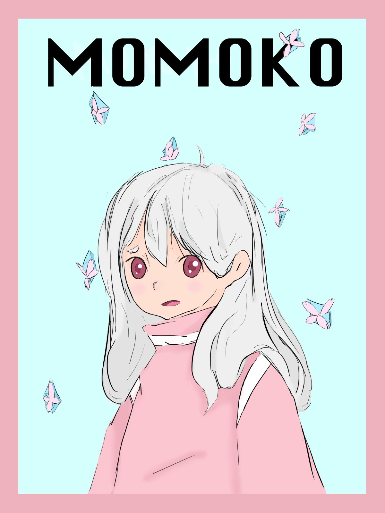

# One Hero: The Card Game #
Online multiplayer strategy game about protecting properties. Fight against other training heroes to become #1!

### Game Features ##
* Turn-based combat
  - Player action points that increase by round
  - Cards require a certain amount of AP
* Multiplayer mode
* Original characters and art design
  - Characters have own unique features
  #### Characters ####
 
 

### Play ##

### Poster Design ##

### Contributions
* Kee-Bum Phiri
  * Worked on front-end/back-end functionality
  * Used NodeJs along with Socket.io for real-time client/server communication between players
* Bianca Guerrero
  * UI/UX designer
  * Artist
  * Worked on front-end functionality
